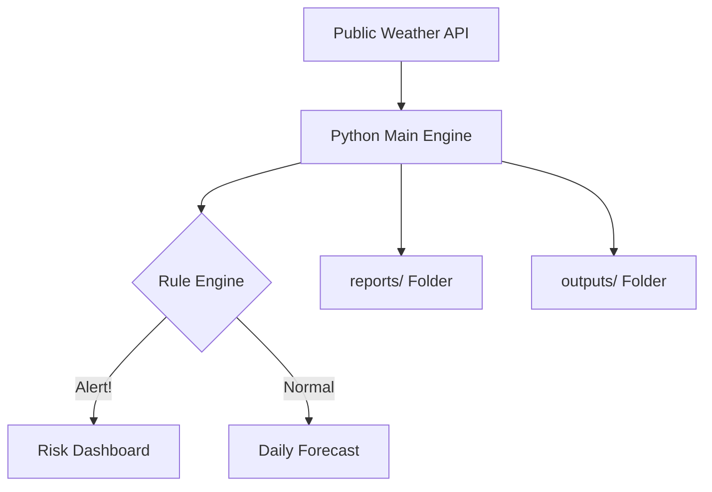

# Weather Forecast & Alert Application 🌤️🚨

## 📁 Repository Structure

### 🗄️ [`/data`](./data)
**Raw Data & Simulation Assets**: 
- Provides `simulation_data.json` for risk-threshold testing.
- Includes `historical_weather.csv` for data analytic demonstrations.
- Acts as a local cache to prevent redundant API calls and ensure consistent demo results.

### 💻 [`/src`](./src)
**Source Code**: Houses the specialized simulation scripts, utility helpers, and internal logic modules that power the weather parsing engine.

### 📊 [`/outputs`](./outputs)
**Graphical Results**: Stores generated Matplotlib charts and data visualizations. This is where recruiters can see the "Proof of Work" through actual data trends.

### 📝 [`/reports`](./reports)
**Audit Logs**: Dedicated to automated timestamped reports. Each run of the Python engine generates a detailed diagnostic text/CSV file here.

### 🖼️ [`/images`](./images)
**Documentation Assets**: Contains dashboard screenshots, architectural diagrams, and visual guides used for project presentations.

### 📚 [`/docs`](./docs)
**Project Knowledge Base**: Includes technical deep-dives, `project_info.md`, and the `interview_prep.md` guides to help you explain the system architecture.

---

## 🚀 System Architecture


## ⚙️ Installation & Usage
1. **Setup Environment**:
   ```bash
   pip install -r requirements.txt
   npm install
   ```
2. **Run Python Engine**:
   ```bash
   python main.py
   ```
3. **Run Web Dashboard**:
   ```bash
   npm run dev
   ```

## 📊 Visual Result Examples (Placeholders)

*Note: Once you run the application, capture these screenshots and place them in the `/images` folder.*

| Dashboard View | Trend Analytics |
| :---: | :---: |
|  |  |
| *Modern Dark UI showing real-time stats* | *24h Temperature & Rain Probability trends* |

| Risk Alerts | CLI Monitoring |
| :---: | :---: |
|  |  |
| *Active warning badges for Heat/Wind/Rain* | *Real-time engine logs & API ingestion* |
